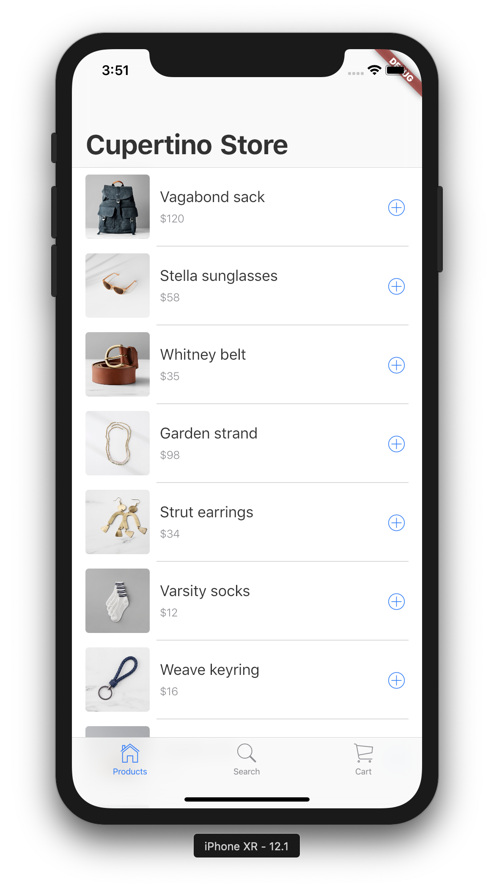
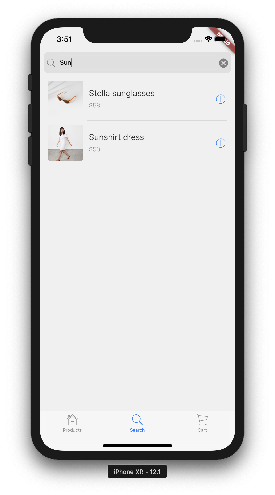
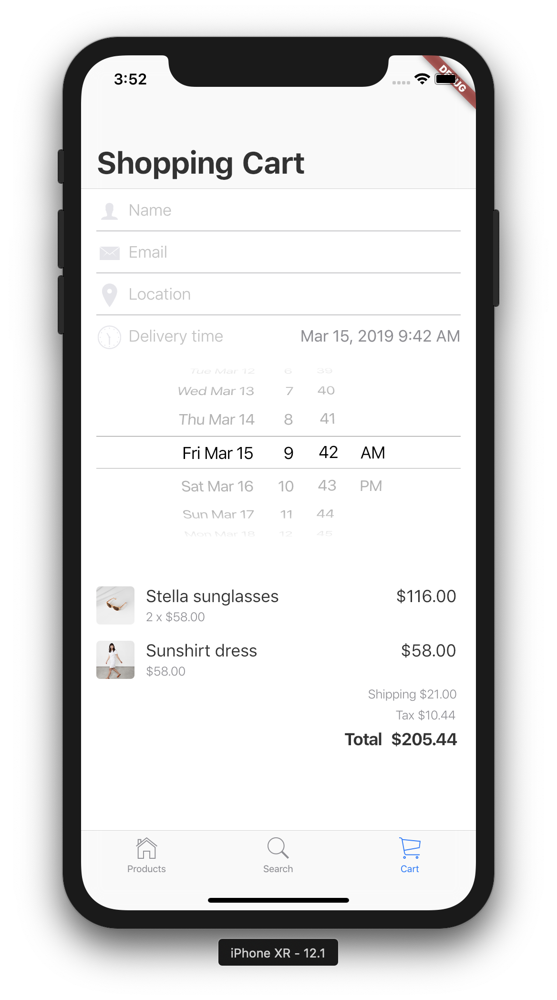

# Flutter Cupertino Store

Ever wanted to create a store app in Flutter that looks totally at home on an 
iOS device? Do we have a deal for you! [Cupertino Widgets][cupertino-widgets] 
empower you to build a Flutter app with beautiful and high-fidelity widgets 
for current iOS design language.

<table>
 <tr>
  <td></td>
  <td></td>
  <td></td>
 </tr>
</table>

[cupertino-widgets]: https://flutter.dev/docs/development/ui/widgets/cupertino